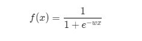
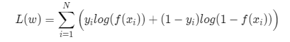
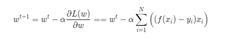

# LogisticRegression

## 难易程度:  \*** 难

## 待完成:

* 请在 DSPPCode.spark.logistic_regression.impl 中创建IterationStepImpl, 继承IterationStep, 实现抽象方法.

## 题目描述:

- 本题目要求使用梯度下降算法求解二项逻辑斯谛回归(Logistic Regression)模型参数。二项逻辑斯蒂回归模型是机器学习中经典的分类模型，求解方法简述如下。逻辑斯蒂回归模型通过拟合一个线性函数，再通过sigmoid函数输出[0,1]区间的概率值，通过概率值来判断因变量的类别，一般以0.5为分界，判断样本类别。如下式（由于idea不解析md中的数学公式，因此以如图片形式给出），

  

    我们使用对数似然函数作为代价函数，如下式。其中N为样本数量

  

  然后使用梯度下降算法求解参数w，如下式（推导过程略）,其中$\alpha$为学习率(步长)

  

### TODO
在DSPPCode.spark.logistic_regression.question.LogisticRegressionRunner中已给出Spark程序拓扑, 但其中求解参数部分需要同学们来实现。
需要完成的内容包括如下三部分：
  1. 按照上文给出公式，结合逻辑斯蒂回归算法的原理，求解梯度，实现IterationStepImpl -> VectorSumImpl 和 IterationStepImpl -> ComputeGradientImpl
  2. 实现模型的迭代步，更新参数 IterationStepImpl -> runStep （请使用给定的学习率）
  3. 实现迭代终止条件： IterationStepImpl -> termination 当参数变化平方距离小于阈值（0.01）时停止迭代

## 样例

### 输入
```
0.0 0.4419053154730548 0.21940794898278793
1.0 -0.24986663689089594 -0.40699028639933776
0.0 -0.4190223619272205 -0.015377204367344577
1.0 -0.11722140739872688 -0.6966434026780435
0.0 -0.8909445130708751 0.7862133923906502
1.0 1.5023071496873626 0.5784870753345065
0.0 0.7105062239438624 -1.3402327822135738
1.0 -0.5096444592532914 1.0537576978720287
0.0 -1.1903496491990075 -0.14927846172563708
1.0 -0.5035510019650835 1.0210160806416415
```
第一列表示数据的类别 1.0 或 0.0 第二列到最后一列表示数据不同维度上的值。数据类型均为double
即<y,x1,x2,...,xn>, 数据维度为n

###输出

```
w0,0.82
w1,1.02
```
第一列模型参数下标，第二列表示对应下标的模型参数值.例子表示数据维度为2的数据经计算后的参数结果

